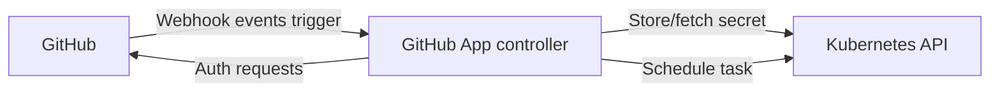
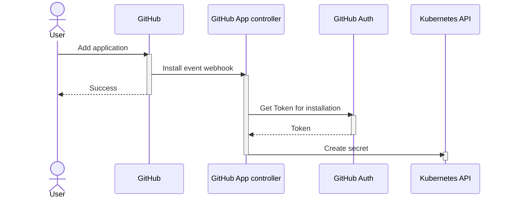
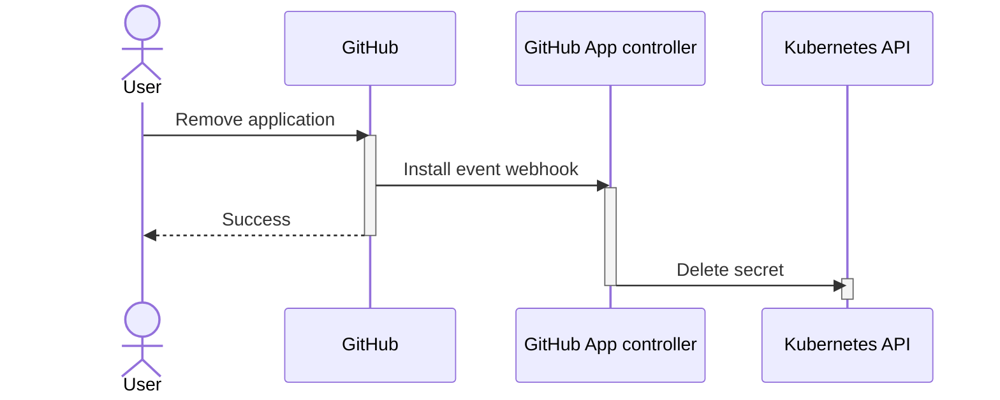
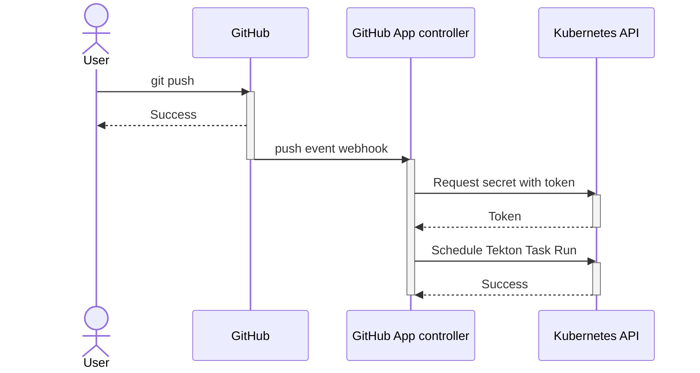
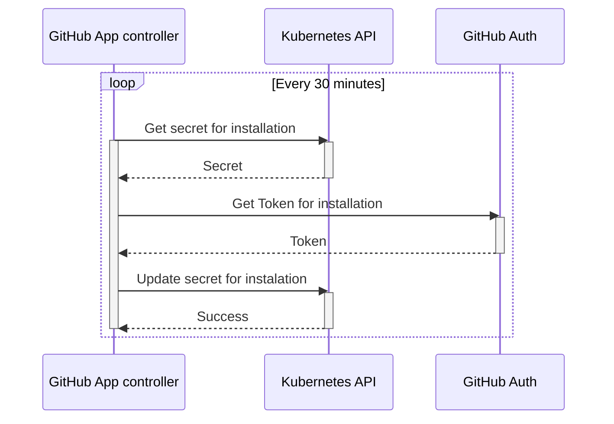

# Design overview - Architecture

This issue should serve as an initial guidance and quick glance overview for Peribolos as a Service

## User subscribe

User subscribes to the application via [GitHub Marketplace](https://github.com/marketplace) and adds it to their organization. This generate an [`installation` event with `action: create`](https://docs.github.com/en/developers/webhooks-and-events/webhooks/webhook-events-and-payloads#installation). Internally we translate this into a Kubernetes Secret creation.

## User unsubscribe

User unsubscribes from the application and removes it from their organization. This generate an [`installation` event with `action: delete`](https://docs.github.com/en/developers/webhooks-and-events/webhooks/webhook-events-and-payloads#installation). Internally we translate this into a Kubernetes Secret deletion.

## Github push event handler

We want to react to push events on GitHub repositories. This is triggered via [`push` webhook event](https://docs.github.com/en/developers/webhooks-and-events/webhooks/webhook-events-and-payloads#push).

## Token management

Github App tokens are installation specific (each organization has its own set of credentials). In order to access git and GitHub API we need to maintain set of tokens, one for each installation/organization. GitHub tokens for applications expire in 1 hour after being generated hence we need to regenerate the token before it expires (with a margin for running pipelines).

Note: If a new token is generated for an installation, the previously created token for the same installation remains valid for normal lifespan - it is not invalidated.

